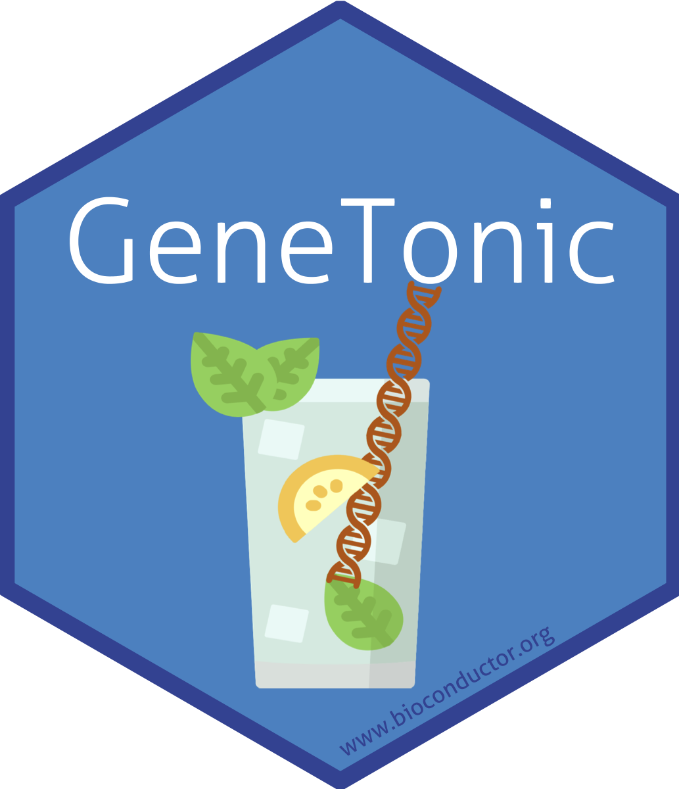

# GeneTonic: enjoying the interpretation of your RNA-seq data analysis 

Authors:  
Federico Marini^[marinif@uni-mainz.de],
Annekathrin Ludt^[anneludt@uni-mainz.de]  
Institute of Medical Biostatistics, Epidemiology and Informatics (IMBEI), Mainz.
<br/>
Last modified: 9 Mar, 2021.

## Overview

### Description

This workshop demonstrates the use of the [GeneTonic](https://bioconductor.org/packages/GeneTonic/) package to integrate and explore the results of RNA-seq experiments, in the context of differential expression and functional enrichment analyses.

This will be proposed as a lab session that combines an instructor-led live demo, followed by hands-on experimentation guided by exercises, hints, and solutions that participants may continue to use after the workshop.

The instructor-led live demo comprises three parts:

1. Overview of the RNA-seq differential expression workflow.
2. Introduction to the GeneTonic package and its functionality.
3. Hands-on exercises and discussion.

Participants are encouraged to ask questions at any time during the workshop.

### Pre-requisites

* Basic knowledge of RNA-seq analysis workflow 
* Familiarity with concepts proper of differential expression analysis (e.g. in the DESeq2 framework, https://bioconductor.org/packages/DESeq2)
* Familiarity with functional enrichment analysis concepts (e.g. with the clusterProfiler package, or using the topGO wrapper included in the pcaExplorer package)

We recommend to use the latest version of R (>= 4.0.0) and the latest release of Bioconductor version (3.13).

Install the GeneTonic package

```
BiocManager::install("GeneTonic")
# alternatively, the development version directly from GitHub
BiocManager::install("federicomarini/GeneTonic")
```

### Participation

Attendees will participate by following along a presentation introducing the GeneTonic package, RMarkdown documents which describe the tasks to perform, trying variations of provided code, and asking questions throughout the workshop.

### _R_ / _Bioconductor_ packages used

* GeneTonic
* DESeq2

### Time outline

| Activity                     | Time |
|------------------------------|------|
| Overview                     | 10m  |
| Introduction to GeneTonic    | 15m  |
| Hands-on exercises           | 60m  |
| Q&As                         | 15m  |

### Workshop goals and objectives

List "big picture" student-centered workshop goals and learning
objectives. Learning goals and objectives are related, but not the
same thing. These goals and objectives will help some people to decide
whether to attend the conference for training purposes, so please make
these as precise and accurate as possible.

*Learning goals* are high-level descriptions of what
participants will learn and be able to do after the workshop is
over. *Learning objectives*, on the other hand, describe in very
specific and measurable terms specific skills or knowledge
attained. The [Bloom's Taxonomy](#bloom) may be a useful framework
for defining and describing your goals and objectives, although there
are others.

### Learning goals

* Integrate the different components from the Differential Expression analysis
workflow
* Utilize interactive web applications to efficiently extract information of the combined input objects
* Adopt means to generate reproducible reports to capture the results of the live exploration

### Learning objectives

* Setup a local environment to run GeneTonic on the results of own RNA-seq experiments
* Interact with the core components of GeneTonic to inspect the provided datasets
* Create a variety of interactive visualizations to summarize and help interpret the data at hand
* Practice the combination of interactivity and reproducibility to combine the advantages of these aspects in a single computational workflow


