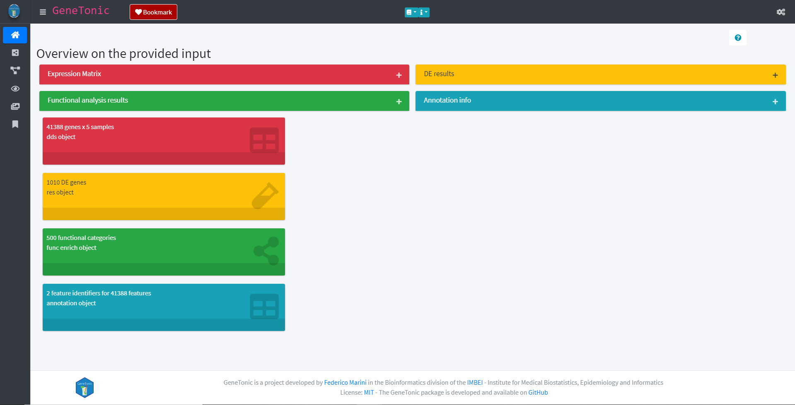
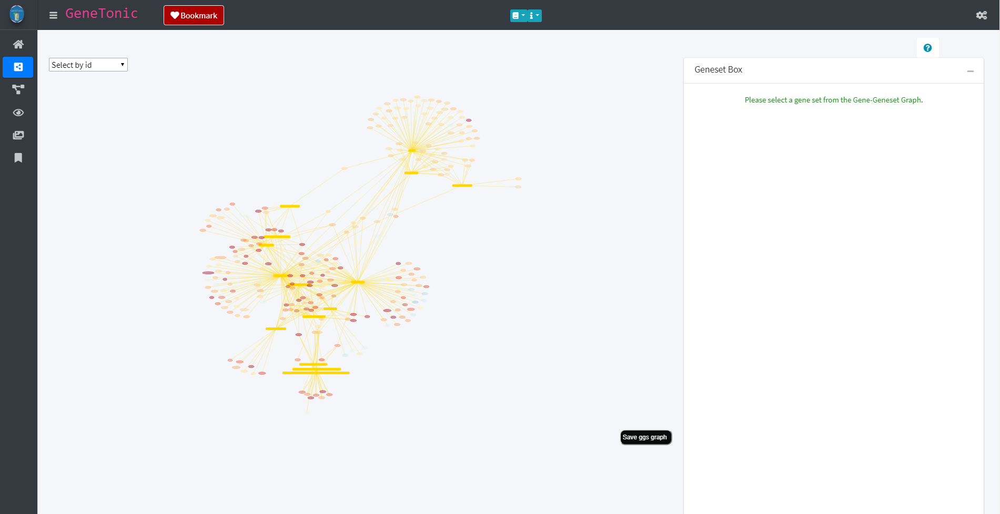
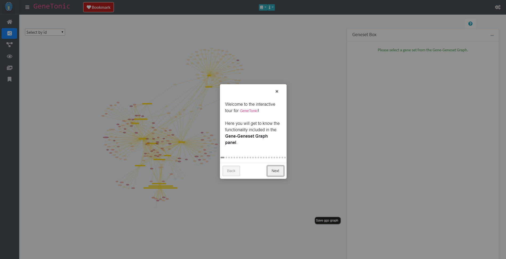
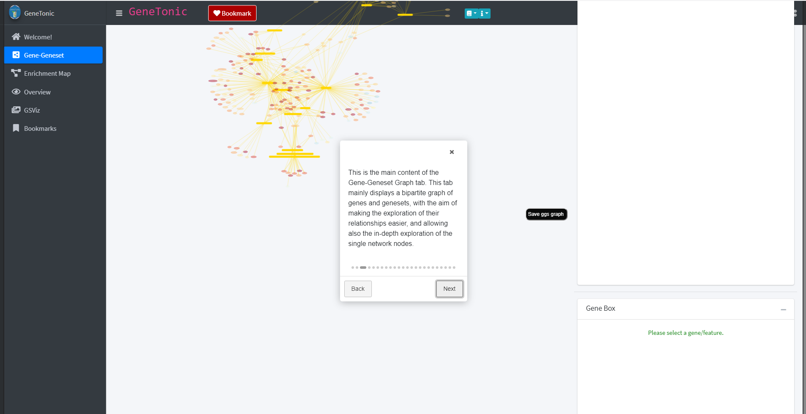
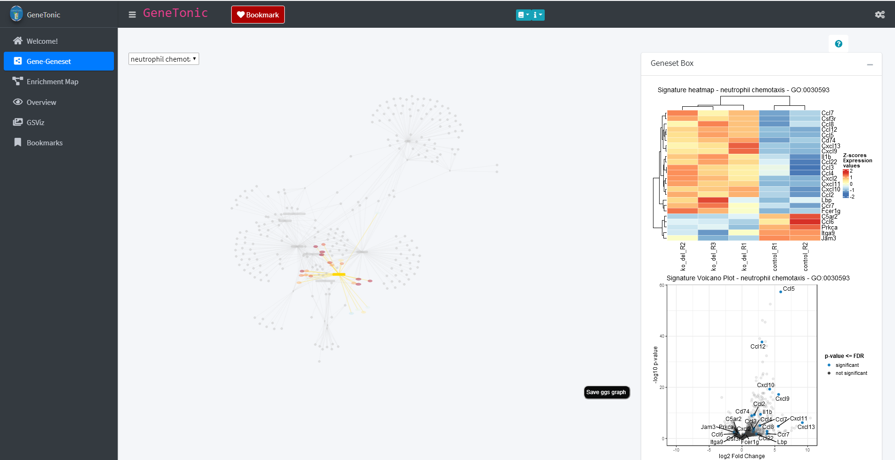
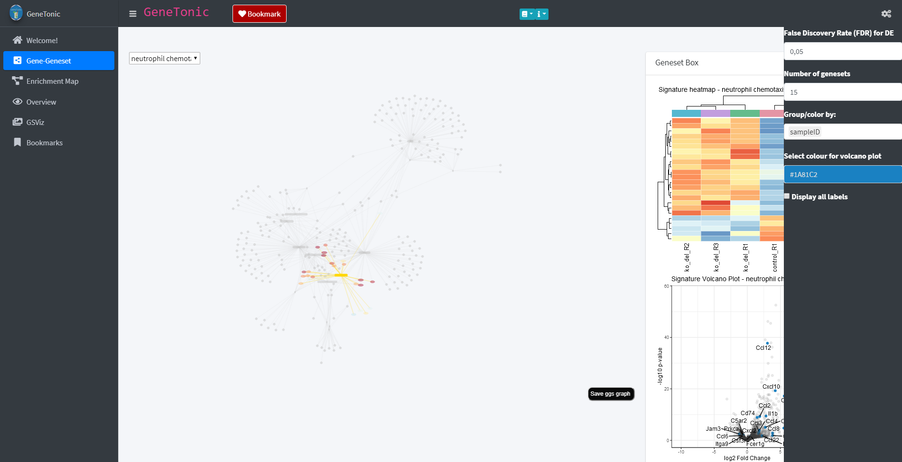
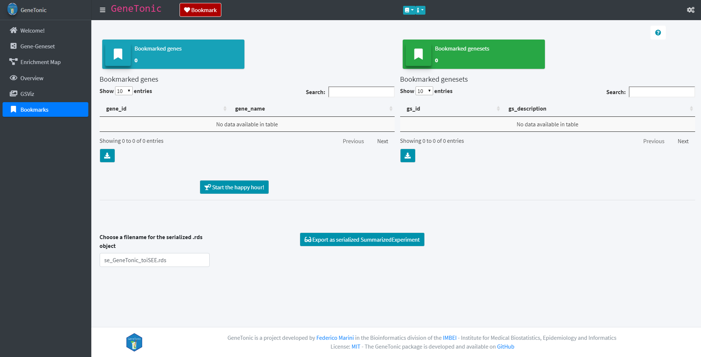

```{r setup, include = FALSE}
knitr::opts_chunk$set(
  collapse = TRUE,
  comment = "#>",
  warning = FALSE,
  message = FALSE,
  fig.height = 7,
  fig.width = 10
)
```

# Setup for this workshop

To install the `GeneTonic` package and the package for this workshop, containing a processed version of the example dataset, execute the following chunk:

```{r install, eval=FALSE}
# from Bioconductor
BiocManager::install("GeneTonic")
# devel version on GitHub
BiocManager::install("federicomarini/GeneTonic")
# this workshop
BiocManager::install("federicomarini/GeneTonicWorkshop",
                     build_vignettes = TRUE,
                     dependencies = TRUE)
```

That should be it!  
To make sure everything is installed correctly, run

```{r loadgtw}
library("GeneTonicWorkshop")
```

# Using GeneTonic on the A20-deficient microglia dataset (GSE123033)

## About the data

The data illustrated in this document is an RNA-seq dataset, available at the GEO repository under the accession code GSE123033 (https://www.ncbi.nlm.nih.gov/geo/query/acc.cgi?acc=GSE123033).  
This was generated as a part of the work to elucidate the role of microglial A20 in maintaining brain homeostasis, comparing fully deficient to partially deficient microglia tissue [@Mohebiany2020] - the manuscript is available at https://www.sciencedirect.com/science/article/pii/S2211124719317620.

## Loading required packages

We load the packages required to perform all the analytic steps presented in this document.

```{r loadLibraries, results='hide'}
library("DESeq2")
library("topGO")
library("pheatmap")
library("org.Mm.eg.db")
library("pcaExplorer")
library("ideal")
library("DT")
library("GeneTonic")
```

## Data processing - Exploratory data analysis

After obtaining a count matrix (via STAR and featureCounts), we generated a `DESeqDataset` object, provided in this repository for the ease of reproducing the presented analyses.

We read in the dataset, apply the rlog transformation for performing PCA and creating a heatmap of the sample to sample distances.  
We'll use some functions from the `pcaExplorer` package [@Marini2019] (see also Supplementary Figure 3 of [@Mohebiany2020]).

These are the preprocessed dataset we are going to use throughout the demo:

```{r demofiles}
list.files(system.file("extdata", package = "GeneTonicWorkshop"))
```

We load the `DESeqDataSet` object and the annotation data frame for handling the conversion between Ensembl ids and gene names, and do a quick exploration of the data

```{r eda-alma}
dds_alma <- readRDS(
  system.file("extdata", "usecase_dds_alma.rds", package = "GeneTonicWorkshop")
)
dds_alma

rld_alma <- rlogTransformation(dds_alma)

anno_df <- readRDS(
  system.file("extdata", "usecase_annodf_alma.rds", package = "GeneTonicWorkshop")
)

pheatmap::pheatmap(as.matrix(dist(t(assay(rld_alma)))))

pcaExplorer::pcaplot(rld_alma,
  ntop = 5000,
  title = "PCA - top5000 most variable genes",
  ellipse = FALSE
)
```

## Data processing - Differential expression analysis

We set the False Discovery Rate to 0.05 and we run the `DESeq2` workflow, generating results and using the `apeglm` shrinkage estimator.  
We plot the results as an MA-plot and report them in a table, using the functions from the `ideal` package [@Marini2020] (see also Supplementary Figure 3 of [@Mohebiany2020]).

```{r de-alma}
FDR <- 0.05

dds_alma <- DESeq(dds_alma)

res_alma_ko_vs_ctrl <- results(dds_alma, name = "condition_ko_del_vs_control", alpha = FDR)
summary(res_alma_ko_vs_ctrl)
library("apeglm")
res_alma_ko_vs_ctrl <- lfcShrink(dds_alma, coef = "condition_ko_del_vs_control", type = "apeglm", res = res_alma_ko_vs_ctrl)

res_alma_ko_vs_ctrl$SYMBOL <- anno_df$gene_name[match(rownames(res_alma_ko_vs_ctrl), anno_df$gene_id)]

summary(res_alma_ko_vs_ctrl)

# saveRDS(res_alma_ko_vs_ctrl, file = "../inst/extdata/usecase_res_de_alma.rds")
```

Alternatively, we load in the results from the object included in the package

```{r load-de}
res_alma_ko_vs_ctrl <- readRDS(
  system.file("extdata", "usecase_res_de_alma.rds", package = "GeneTonicWorkshop")
)
```


```{r de-alma-plot}
ideal::plot_ma(res_alma_ko_vs_ctrl, ylim = c(-5, 5), title = "MAplot - A20ko vs Ctrl")

tbl_DEres_alma_ko_vs_ctrl <- GeneTonic::deseqresult2df(res_alma_ko_vs_ctrl, FDR = FDR)

DT::datatable(tbl_DEres_alma_ko_vs_ctrl, rownames = FALSE)
```

## Data processing - Functional enrichment analysis

We perform functional enrichment analysis, here using the `topGOtable` wrapper (from `pcaExplorer`) to the method implemented in the `topGO` package.

```{r enrich-alma, cache=TRUE}
expressedInAssay <- (rowSums(assay(dds_alma)) > 0)
geneUniverseExprENS <- rownames(dds_alma)[expressedInAssay]
geneUniverseExpr <- anno_df$gene_name[match(geneUniverseExprENS, anno_df$gene_id)]

GObps_ko_vs_ctrl <- topGOtable(
  DEgenes = tbl_DEres_alma_ko_vs_ctrl$SYMBOL,
  BGgenes = geneUniverseExpr,
  ontology = "BP",
  geneID = "symbol",
  addGeneToTerms = TRUE,
  mapping = "org.Mm.eg.db",
  topTablerows = 500
)

GOmfs_ko_vs_ctrl <- topGOtable(
  DEgenes = tbl_DEres_alma_ko_vs_ctrl$SYMBOL,
  BGgenes = geneUniverseExpr,
  ontology = "MF",
  geneID = "symbol",
  addGeneToTerms = TRUE,
  mapping = "org.Mm.eg.db",
  topTablerows = 500
)

GOccs_ko_vs_ctrl <- topGOtable(
  DEgenes = tbl_DEres_alma_ko_vs_ctrl$SYMBOL,
  BGgenes = geneUniverseExpr,
  ontology = "CC",
  geneID = "symbol",
  addGeneToTerms = TRUE,
  mapping = "org.Mm.eg.db",
  topTablerows = 500
)
```

We take for example the results of the enrichment in the Biological Processes ontology, and convert them for use in `GeneTonic`

```{r shaker-alma}
res_enrich_a20 <- shake_topGOtableResult(GObps_ko_vs_ctrl)
```

We compute some aggregated scores - this additional columns will come in handy to colorize points, encoding for information about the direction of regulation of each biological process

```{r aggrscores-alma}
res_enrich_a20 <- get_aggrscores(
  res_enrich = res_enrich_a20,
  res_de = res_alma_ko_vs_ctrl,
  annotation_obj = anno_df
)

# saveRDS(res_enrich_a20, file = "../inst/extdata/usecase_res_enrich_alma.rds")

DT::datatable(res_enrich_a20, rownames = FALSE)
```

If desired, you can load directly the enrichment results, already converted for `GeneTonic`, from the objects provided in this workshop package:

```{r load-enrich}
res_enrich_a20 <- readRDS(
  system.file("extdata", "usecase_res_enrich_alma.rds", package = "GeneTonicWorkshop")
)
```

### Using alternative enrichment analysis methods

It is possible to use the output of different other methods for enrichment analysis, thanks to the `shaker_*` functions implemented in `GeneTonic` - see for example `?shake_topGOtableResult`, and navigate to the manual pages for the other functions listed in the "See Also" section.

`GeneTonic` is able to convert for you the output of

- DAVID (text file, downloaded from the DAVID website)
- clusterProfiler (takes `enrichResult` objects)
- enrichr (a data.frame with the output of `enrichr`, or the text file exported from Enrichr)
- fgsea (the output of `fgsea()` function)
- g:Profiler (the text file output as exported from g:Profiler, or a data.frame with the output of `gost()` in `gprofiler2`)

Some examples on how to use them are reported here:

```{r alt-enrich, eval=FALSE}
# clusterProfiler --------------------------------------------------------------
library("clusterProfiler")
degenes_alma <- deseqresult2df(res_alma_ko_vs_ctrl, FDR = 0.05)$id
ego_alma <- enrichGO(
  gene = degenes_alma,
  universe = rownames(dds_alma)[expressedInAssay],
  OrgDb = org.Mm.eg.db,
  ont = "BP",
  keyType = "ENSEMBL",
  pAdjustMethod = "BH",
  pvalueCutoff = 0.01,
  qvalueCutoff = 0.05,
  readable = TRUE
)
res_enrich_clusterprofiler <- shake_enrichResult(ego_alma)

# g:profiler -------------------------------------------------------------------
library("gprofiler2")
degenes <- deseqresult2df(res_alma_ko_vs_ctrl, FDR = 0.05)$SYMBOL
gostres_a20 <- gost(
  query = degenes,
  ordered_query = FALSE,
  multi_query = FALSE,
  significant = FALSE,
  exclude_iea = TRUE,
  measure_underrepresentation = FALSE,
  evcodes = TRUE,
  user_threshold = 0.05,
  correction_method = "g_SCS",
  domain_scope = "annotated",
  numeric_ns = "",
  sources = "GO:BP",
  as_short_link = FALSE
)

res_enrich_gprofiler <- shake_gprofilerResult(gprofiler_output = gostres_a20$result)

# fgsea ------------------------------------------------------------------------
library("dplyr")
library("tibble")
library("fgsea")
library("msigdbr")
res2 <- res_alma_ko_vs_ctrl %>%
  as.data.frame() %>%
  dplyr::select(SYMBOL, log2FoldChange)
de_ranks <- deframe(res2)
msigdbr_df <- msigdbr(species = "Mus musculus", category = "C5", subcategory = "BP")
msigdbr_list <- split(x = msigdbr_df$gene_symbol, f = msigdbr_df$gs_name)
fgseaRes <- fgsea(
  pathways = msigdbr_list,
  stats = de_ranks,
  nperm = 100000
)
fgseaRes <- fgseaRes %>%
  arrange(desc(NES))

res_enrich_fgsea <- shake_fgseaResult(fgsea_output = fgseaRes)

# enrichr ----------------------------------------------------------------------
library("enrichR")
dbs <- c(
  "GO_Molecular_Function_2018",
  "GO_Cellular_Component_2018",
  "GO_Biological_Process_2018",
  "KEGG_2019_Human",
  "Reactome_2016",
  "WikiPathways_2019_Human"
)
degenes <- (deseqresult2df(res_alma_ko_vs_ctrl, FDR = 0.05)$SYMBOL)
enrichr_output_a20 <- enrichr(degenes, dbs)

res_enrich_enrichr_BPs <- shake_enrichrResult(
  enrichr_output = enrichr_output_a20$GO_Biological_Process_2018
)
res_enrich_enrichr_KEGG <- shake_enrichrResult(
  enrichr_output = enrichr_output_a20$KEGG_2019_Human
)
```

## Assembling the `gtl` object

To simplify the usage of the function from `GeneTonic`, we create a `GeneTonic_list` object

```{r assemble-gtl}
gtl_alma <- GeneTonic_list(
  dds = dds_alma,
  res_de = res_alma_ko_vs_ctrl,
  res_enrich = res_enrich_a20,
  annotation_obj = anno_df
)

# saveRDS(gtl_alma, "../inst/extdata/gtl_alma.rds")
```

Again, if desired, you could load the `gtl` object directly from the precomputed objects

```{r load-gtl}
gtl_alma <- readRDS(
  system.file("extdata", "gtl_alma.rds", package = "GeneTonicWorkshop")
)
```


# Running `GeneTonic` on the dataset, interactively

We do have a `GeneTonicList` object, containing all the structured input needed.  
We can inspect its content with the internal `GeneTonic:::describe_gtl()`

```{r desc-gtl}
GeneTonic:::describe_gtl(gtl_alma)
```

This command will launch the `GeneTonic` app:

```{r run-gt, eval=FALSE}
GeneTonic(gtl = gtl_alma)
```

The exploration can be guided by launching the introductory tours for each section of the app, and finally one can generate a small report focused on the features and genesets of interest.

## Exploring the `GeneTonic` app

The `GeneTonic` app provides various different panels and plots to visualize your data. When launching the app as shown above, the `GeneTonic` app will start and show information about the provided data in the Welcome panel. 



The panel list the individual inputs of the `GeneTonic` app with some overall information (e.g. the number of DE genes). Further information about the input can be acquired by clicking the plus sign of each respective input.

Via the panel selection on the left site, individual panels can be explored. One of these panels is the Gene-Geneset panel which provides information about the genesets and genes found in the data based on the functional annotation object. The genesets and their belonging genes are depicted in a graph in which the genesets are shown as yellow rectangles and the genes as round nodes. The node color of the genes reflects their regulation in the data with red indicating an up-regulation and blue a down-regulation. 


Each panel offers a variety of different possibilities and options to explore the data. In order to familiarize with these options, each panel has a guided tour which highlights and explains the different possibilities. The tour can be started by clicking on the question mark button (in the image above this the button can be found above the Geneset box). The button activates the tour which will open as a small window on the screen. 



The "Next" and "Back" button lead through the tour and its individual elements. Throughout the tour individual elements of the respective panel will be highlighted and explained.


the panels of the `GeneTonic` app are designed interactively and offer the possibility of exploring the data by clicking on various elements of the page. For example through clicking on one of the genesets in the shown graph (yellow rectangle) additional content will be displayed in the Geneset box. In the case of a geneset these are a heatmap and a volcano plot which provide additional information about the regulation of the genes contained in the geneset. 



The information provided by the heatmap and volcano plot of each geneset can further be broadened. For this several options are provided through clicking on the cog-wheel symbol in the upper right corner of the page. This opens a sidebar with several additional options. These options include the choice of FDR threshold, the number of genesets displayed in the main graph of the page or a drop-down menu which allows to group/color the displayed heatmap by different factors e.g. the sample id.



`GeneTonic` offers a wide range of visualizations of the data in each of the individual panels ranging from birds-eye view plots to detailed plots about specific subsets of the data. However, if some more custom visualizations are required, it is possible to export the objects in use from the app as a SummarizedExperiment object, to be then passed to the `iSEE` software [@Rue-Albrecht2018] for further exploration. Furthermore, the app also offers the possibility to generate a report about genes and genesets of interest. This can be achieved by bookmarking those genes and genesets via the "Bookmark" button found in each panel. The report and SummarizedExperiment object can then be generated in the Bookmark panel by clicking the button "Start the happy hour!" (for the report) or "Export as serialized SummarizedExperiment" (for the SummarizedExperiment)



# Using `GeneTonic`'s functions in analysis reports 

The functionality of `GeneTonic` can be used also as standalone functions, to be called for example in existing analysis reports in RMarkdown, or R scripts.  
In the following chunks, we show how it is possible to call some of the functions on the A20-deficient microglia set.

For more details on the functions and their outputs, please refer to the package documentation and the vignette.

## Genesets and genes

We can represent the relationships between genesets and genes with `enhance_table()`, `gs_summary_heat()`, and `ggs_graph()`:

```{r genesets-genes}
p <- enhance_table(
  gtl = gtl_alma,
  n_gs = 30,
  chars_limit = 60
)
p

## could be made interactive with...
# library("plotly")
# ggplotly(p)

gs_summary_heat(
  gtl = gtl_alma,
  n_gs = 5
)


ggs <- ggs_graph(
  gtl = gtl_alma,
  n_gs = 20
)
ggs
## could be viewed interactively with
library("visNetwork")
library("magrittr")
ggs %>%
  visIgraph() %>%
  visOptions(
    highlightNearest = list(
      enabled = TRUE,
      degree = 1,
      hover = TRUE
    ),
    nodesIdSelection = TRUE
  )
```

## Overview representations

We can also obtain summary representations of the enrichment results, either as table-like views (with `gs_volcano()`, `gs_summary_overview()`, `gs_fuzzyclustering()`, `gs_scoresheat()`), or to represent the relationships among genesets (via `enrichment_map()`, `gs_dendro()`, `gs_mds()`)

```{r gs-overviews}
gs_volcano(
  res_enrich = res_enrich_a20,
  p_threshold = 0.05,
  color_by = "aggr_score",
  volcano_labels = 5,
  gs_ids = c("GO:0033690", "GO:0050770"),
  plot_title = "A20-microglia geneset volcano"
)

gs_summary_overview(
  res_enrich = res_enrich_a20,
  n_gs = 60,
  p_value_column = "gs_pvalue",
  color_by = "z_score"
)

res_enrich_subset <- res_enrich_a20[1:200, ]
fuzzy_subset <- gs_fuzzyclustering(
  res_enrich = res_enrich_subset,
  n_gs = nrow(res_enrich_subset),
  gs_ids = NULL,
  similarity_matrix = NULL,
  similarity_threshold = 0.35,
  fuzzy_seeding_initial_neighbors = 3,
  fuzzy_multilinkage_rule = 0.5
)

# show all genesets members of the first cluster
DT::datatable(
  fuzzy_subset[fuzzy_subset$gs_fuzzycluster == "1", ]
)

# list only the representative clusters
DT::datatable(
  fuzzy_subset[fuzzy_subset$gs_cluster_status == "Representative", ]
)


vst_alma <- vst(dds_alma)
scores_mat <- gs_scores(
  se = vst_alma,
  gtl = gtl_alma
)
gs_scoresheat(scores_mat,
  n_gs = 30
)
```


```{r gt-emap, eval = FALSE}
em <- enrichment_map(gtl = gtl_alma, n_gs = 100)

library("visNetwork")
library("magrittr")
em %>%
  visIgraph() %>%
  visOptions(
    highlightNearest = list(
      enabled = TRUE,
      degree = 1,
      hover = TRUE
    ),
    nodesIdSelection = TRUE
  )

distilled <- distill_enrichment(
  gtl = gtl_alma,
  n_gs = 100,
  cluster_fun = "cluster_markov"
)
DT::datatable(distilled$distilled_table)
DT::datatable(distilled$res_enrich)

dg <- distilled$distilled_em

library("igraph")
library("visNetwork")
library("magrittr")

# defining a color palette for nicer display
colpal <- colorspace::rainbow_hcl(length(unique(V(dg)$color)))[V(dg)$color]
V(dg)$color.background <- scales::alpha(colpal, alpha = 0.8)
V(dg)$color.highlight <- scales::alpha(colpal, alpha = 1)
V(dg)$color.hover <- scales::alpha(colpal, alpha = 0.5)

V(dg)$color.border <- "black"

visNetwork::visIgraph(dg) %>%
  visOptions(
    highlightNearest = list(
      enabled = TRUE,
      degree = 1,
      hover = TRUE
    ),
    nodesIdSelection = TRUE,
    selectedBy = "membership"
  )


gs_dendro(
  gtl = gtl_alma,
  n_gs = 50,
  gs_dist_type = "kappa",
  clust_method = "ward.D2",
  color_leaves_by = "z_score",
  size_leaves_by = "gs_pvalue",
  color_branches_by = "clusters",
  create_plot = TRUE
)

gs_mds(
  gtl = gtl_alma,
  n_gs = 200,
  gs_ids = NULL,
  similarity_measure = "kappa_matrix",
  mds_k = 2,
  mds_labels = 10,
  mds_colorby = "z_score",
  gs_labels = NULL,
  plot_title = NULL
)
```

## General use functions

It is possible to obtain focused representations and descriptions of single genesets with `gs_heatmap()`, `go2html()`, and `signature_volcano()` - these need the Gene Ontology identifier to generate the desired content, while the `gtl` object contains all the necessary expression matrices and tables.

```{r gs-general}
gs_heatmap(
  se = vst_alma,
  gtl = gtl_alma,
  geneset_id = "GO:0060337",
  cluster_columns = TRUE,
  anno_col_info = "condition"
)

go_2_html("GO:0060337",
  res_enrich = res_enrich_a20
)

signature_volcano(
  gtl = gtl_alma,
  geneset_id = "GO:0060337",
  FDR = 0.05,
  color = "#1a81c2"
)
```

As an example, these plots are related to the data presented in Figure 3 of [@Mohebiany2020].

```{r gs-synapse}
genes_synapse_assembly <- c(
  "Bhlhb9",
  "Mef2c",
  "Clstn1",
  "Amigo1",
  "Eef2k",
  "Ephb3",
  "Thbs2",
  "Pdlim5"
)

genes_synapse_assembly_ensids <-
  anno_df$gene_id[match(genes_synapse_assembly, anno_df$gene_name)]

gs_heatmap(
  se = vst_alma,
  gtl = gtl_alma,
  genelist = genes_synapse_assembly_ensids,
  cluster_columns = TRUE,
  cluster_rows = FALSE,
  anno_col_info = "condition"
)


res_enrich_a20[res_enrich_a20$gs_id == "GO:0051607", ]

gs_heatmap(
  se = vst_alma,
  gtl = gtl_alma,
  geneset_id = "GO:0051607",
  cluster_columns = TRUE,
  anno_col_info = "condition"
)
```

## Comparing enrichment results

Imagine we were to compare the enrichment results from our study to another one where the same set of pathways is reported - or alternatively, on the same dataset but focusing on a different contrast.
We can replicate such a situation by shuffling the results in `res_enrich_a20`, and displaying the comparison with `gs_radar()`, `gs_summary_overview_pair()`, or `gs_horizon()`

```{r gs-compare}
# with more than one set
res_enrich_shuffled <- res_enrich_a20[1:60, ]
set.seed(42)
shuffled_ones <- sample(seq_len(60)) # to generate permuted p-values
res_enrich_shuffled$gs_pvalue <- res_enrich_shuffled$gs_pvalue[shuffled_ones]
# ideally, I would also permute the z scores and aggregated scores
gs_radar(res_enrich = res_enrich_a20,
         res_enrich2 = res_enrich_shuffled)

gs_summary_overview_pair(res_enrich = res_enrich_a20,
                         res_enrich2 = res_enrich_shuffled,
                         n_gs = 60)

gs_horizon(res_enrich = res_enrich_a20,
           compared_res_enrich_list = list(
             a20_shuffled = res_enrich_shuffled),
           n_gs = 40
          )
```


## Integrated reporting

The reporting functionality of `happy_hour()` can be called anytime also from the command line, focusing on a subset of genes and genesets of interest, which will be presented with additional detail in the output document.

```{r happyhour, eval=FALSE}
happy_hour(
  gtl = gtl_alma,
  project_id = "a20-microglia",
  mygenesets = c(
    res_enrich_a20$gs_id[c(1:5, 11, 31)],
    # additionally selecting some by id
    "GO:0051963" # regulation of synapse assembly
  ),
  mygenes = c(
    "ENSMUSG00000035042",
    "ENSMUSG00000074896",
    "ENSMUSG00000035929"
  ),
  open_after_creating = TRUE
)
```


## Alternate entry point - using `edgeR` for the DE analysis

It is also possible to use `edgeR` to perform the steps before using `GeneTonic`.  
The chunk below reports an example of how to do so - imagine you start with a `DGE` object called `dge_alma`:

```{r with-edger}
library("DEFormats")
library("edgeR")
dge_alma <- as.DGEList(dds_alma)
```

We add the gene symbols for ease of readability... 

```{r add-genenames}
dge_alma$genes$SYMBOL <- anno_df$gene_name[match(rownames(dge_alma$genes), anno_df$gene_id)]
```

... and perform a QL-based analysis, obtaining the `qlf` object at the end of it.

```{r edger-run}
keep <- filterByExpr(dge_alma)
table(keep)
y <- dge_alma[keep, , keep.lib.sizes = FALSE]
y <- calcNormFactors(y)
conds <- dge_alma$samples$group
design <- model.matrix(~conds)
y <- estimateDisp(y, design)
# To perform quasi-likelihood F-tests:
fit <- glmQLFit(y, design)
qlf <- glmQLFTest(fit, coef = "condsko_del")
plotMD(qlf)
```

We would need to convert these objects back to the `DESeq2`-based objects.

```{r convert-back}
convert_to_DESeqResults <- function(dgelrt, dge, FDR = 0.05) {
  tbledger <- as.data.frame(topTags(dgelrt, n = Inf))
  colnames(tbledger)[colnames(tbledger) == "PValue"] <- "pvalue"
  colnames(tbledger)[colnames(tbledger) == "logFC"] <- "log2FoldChange"
  colnames(tbledger)[colnames(tbledger) == "logCPM"] <- "baseMean"
  colnames(tbledger)[colnames(tbledger) == "SYMBOL"] <- "SYMBOL"
  
  # get from the logCPM to something on the scale of the baseMean
  tbledger$baseMean <- (2^tbledger$baseMean) * mean(dge$samples$lib.size) / 1e6
  
  # use the constructor for DESeqResults
  edger_resu <- DESeqResults(DataFrame(tbledger))
  edger_resu <- DESeq2:::pvalueAdjustment(edger_resu,
    independentFiltering = FALSE,
    alpha = FDR, pAdjustMethod = "BH"
  )
}

res_de_from_edgeR <- convert_to_DESeqResults(qlf, dge_alma)

summary(decideTestsDGE(qlf))
summary(res_de_from_edgeR, alpha = 0.05)

dds_alma_from_edgeR <- as.DESeqDataSet(dge_alma)
```

Imagine we have already our `res_enrich` object, obtained in any of the ways specified above - then we can simply launch `GeneTonic` with these commands (utilizing the `anno_df` object from the examples above):

```{r run-from-edger, eval=FALSE}
gtl_from_edgeR <- GeneTonic_list(
  dds = dds_alma_from_edgeR,
  res_de = res_de_from_edgeR,
  res_enrich = res_enrich_clusterprofiler,
  annotation_obj = anno_df
)
GeneTonic(gtl = gtl_from_edgeR)
```


# Session information {-}

```{r sessioninfo}
sessionInfo()
```

# Bibliography {-}


